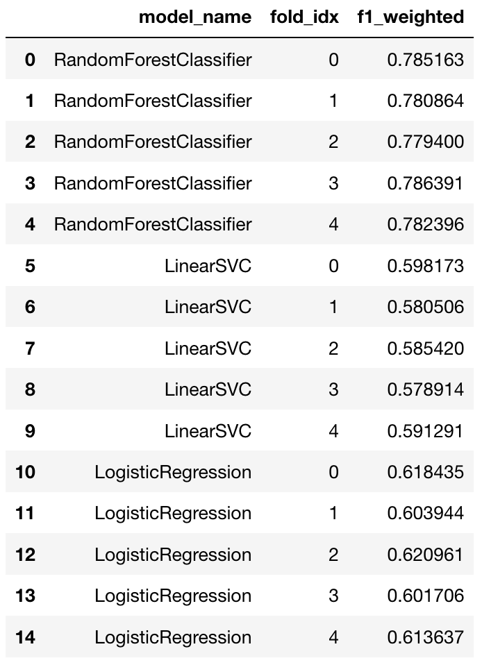
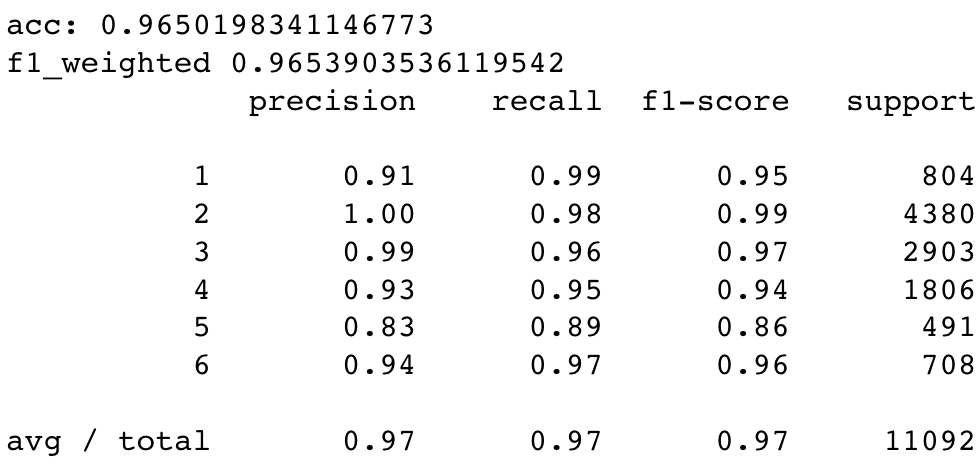
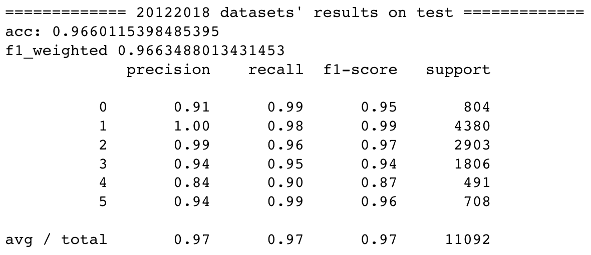
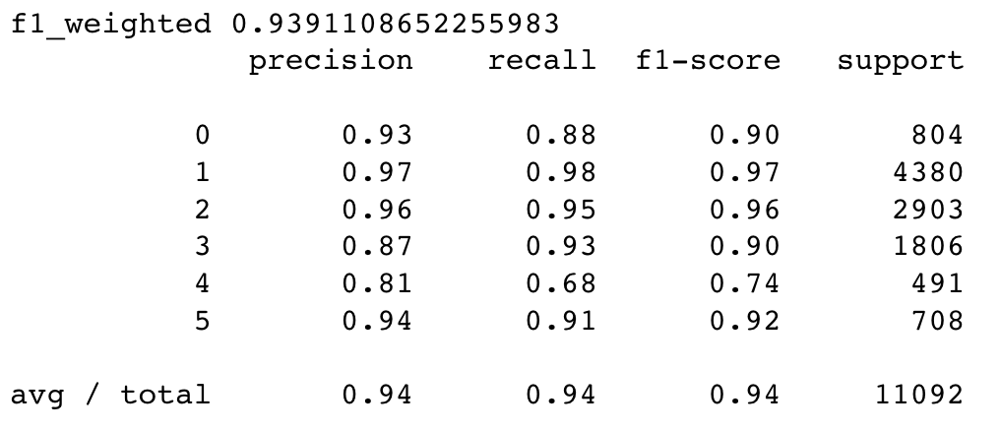
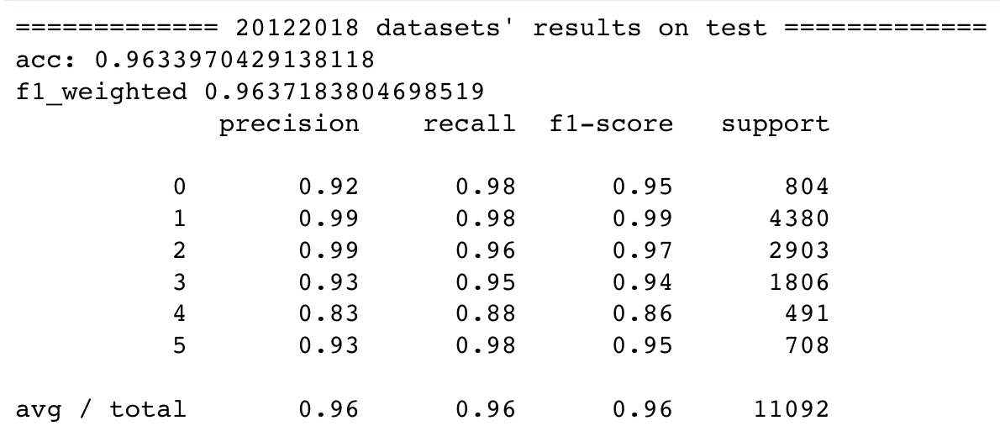

# machine learning methods

## four features

- model selection

- Fine-tuning parameters in Random Forest

- gcForest

## get_dummies
- (33612, 343)
- Fine-tuning parameters in Random Forest

- gcForest
