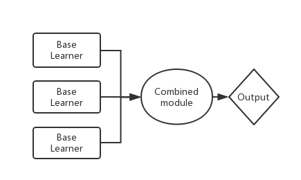
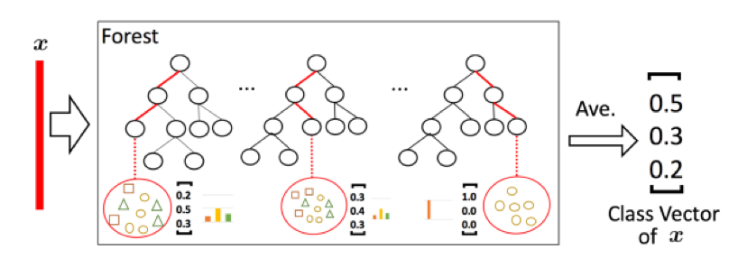
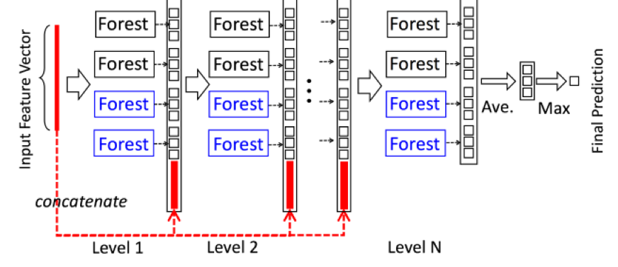

# Classification of water quality grades based on deep cascade forest

# Abstract

In order to solve the traditional methods such as logistic regression, SVM, decision tree, can not make full use of water monitoring features to predict the water quality grade and the difficulty of fitting well. A water quality grade classification method based on deep cascade forest is proposed. First, according to the water quality monitoring data from China Water Quality Automatic Monitoring Weekly. We proposed two models to predict the water quality grade. One is based on 4 evaluation factor of water : pH, Dissolved oxygen(mg/l), Permanganate index(mg/l), NH3-N(mg/l), the other is based on the 4 evaluation factor and 3 geographical location information: river system, monitoring site and river name. After using traditional machine learning methods such as logistic regression, SVM, decision tree and random forest to predict the water quality grade, we concluded that random forest model has the highest weighted F1 and the highest accuracy. Applying the deep cascade forest model, we got better results in the classification of water quality than the traditional machine learning methods.

# Introduction

水污染有多严重，强调水污染研究的重要性。diss 一下别人的方法，in our work, propose a novel way to solve the issue. 介绍一下自己一用了什么东西

Water is the source of life and one of the basic conditions for all living things to survive. It is also an important condition for human survival and development. The world is currently worried about the crisis facing clean water. Water resources are basic natural resources and an important part of human living environment. China's water resources are worrying: serious water pollution. With the development of social economy, the demand of water for industry and agriculture is large, leading to aggravated water pollution. Therefore, it is particularly important to be able to effectively predict water quality grades.

# related work
In this section,  methods of water quality assessment relevant to the previously mentioned approaches will be reviewed. As discussed in the introduction part, our approach has high accuracy and high weighted F1 score in the water quality assessment. 

很久之前，水污染都是人工的！
- Online monitoring method
# Our approach

Deep forest is a decision tree ensemble approach proposed by Zhou and Feng. Compared with deep neural networks, it has less hyper parameters and its model complexity can be automatically determined in a data-dependent way. Its performace is quite robust to hyper-parameter settings, also has excellent performace.

Compared with the traditional machine learning model, while applying the deep forest model to water quality evaluation, the model has the characteristics of being difficult to over-fitting and has high adaptability to low-dimensional and high-dimensional data. At the same time, it has both excellent performance on massive water monitoring data and a small amount of water monitoring data. The comparison results are presented in Sect 4. 

## Data Overview

Data comes from the Ministry of Environmental Protection of the People's Republic (http://www.mee.gov.cn/), The weekly report on automatic monitoring of water quality in important sections of major river basins contains river system, river name, monitoring sites, four evaluation factors include pH, DO, CODmn, NH3-N. Depend on the data from the Weekly report, we proposed two models to do the water assessment (i) based on 4 evaluation factors. (ii) base on 3 geographic location features and 4 evaluation factors. 
	
The overview of data is shown in the Table 1.

Table 1: Variables in dataset and their descriptions
| Variable        |  Description   |
| --------   | -----:  |
| river system     | river system |
| monitoring sites     |  monitoring sites   |
| river name      |    river name  |
|  pH        |    pH value of the water  |
| Dissolved oxygen    |   Amount of dissolved oxygen in the water, given in mg/L  |
| Permanganate index    |    The permanganate index of the water, given in mg/L   |
| NH3-N    |    Amount of NH3-N in the water, given in mg/L|

\hline
Variable & Description \\
\hline
river system & river system\\ 
\hline
monitoring sites &  monitoring sites\\
\hline
river name & river name\\
\hline
pH&pH value of the water \\
\hline
Dissolved oxygen&Amount of dissolved oxygen in the water, given in mg/L \\
\hline
Permanganate index&The permanganate index of the water, given in mg/L \\
\hline
NH3-N&Amount of NH3-N in the water, given in mg/L \\
\hline
## Data Preprocessing
### Z-Score standardization
First, we do the Z-Score standardization on the numerical feature in order to let all features has same degree of influence on parameters. A Z-Score can tell you where the data is compared to the mean value. 

Simply put, a Z-Score is the number of standard deviations from the mean a data point is. (Formulation 1)

Formulation 1:
$$z = \frac{x –\mu}{\sigma}  $$ 

where $x$ is the variable value, $\mu$ is the mean of the data, $\sigma$ is the standard deviation of the data.

A sample of our data is represented by multiple features and each feature has a different dimension. By Z-Score standardizing, different features can be made to have the same scale so that they can be put together for comparison due to the same degree of influence on parameters.

Z-Score: Definition, Formula and Calculation
https://www.statisticshowto.datasciencecentral。com/probability-and-statistics/Z-score/#Whatisazscore
### One-Hot Encoding 	
What is One Hot Encoding? Why And When do you have to use it?
https://hackernoon.com/what-is-one-hot-encoding-why-and-when-do-you-have-to-use-it-e3c6186d008f

What is one-hot encoding and when is it used in data science?
https://www.quora.com/What-is-one-hot-encoding-and-when-is-it-used-in-data-science

## Ensemble Learning and Diversity
Ensemble learning is a machine learning paradigm where multiple learners (e.g., classifiers) are trained and combined for a task. It is well known that an ensemble can usually achieve better generalization performance than single learners.

Ensemble Learning: Combine multiple weak learners into a strong learner

In order to construct a good ensemble, the individual learners should be accurate and diverse. The theory is derived from error-ambiguity decomposition\cite{krogh1995neural}, as shown in the Formulation 2:
Formulation 2
$$E = \overline{E} - \overline{A}$$
where $E$ is the error of an ensemble, $\overline{E}$ is the average error of individual classifiers in the ensemble, $\overline{A}$ is the average ambiguity of the individual classifiers. The lager the ambiguity, the higher the diversity. In the ensemble learning, it is necessary to generate individual learner with high diversity, by introducing random disturbances, such as data sample perturbation, input feature perturbation, output representation perturbation and algorithm parameter perturbation. 

For example, different individual learners use different data sampling methods belonging to data sample perturbations. Each decision tree in the random forest adopts different feature division methods so that random forest model can get lower generalization errors by increasing input feature perturbations. By using different output representations for different individuals to increase the output representation perturbation, e.g., ECOC employs error-correcting output codes, whereas Flipping Output randomly switches labels of training instances. Different individual learners use different parameters belonging to algorithm parameter perturbation.

The deep forest can contains random forest classifier, extremely randomized trees classifier and other classifier. The random forest classifier and the extremely randomized trees classifier can increase the input feature perturbation and data sample perturbation. Different individuals use different data sampling method, then combine all the individuals` output together using voting to get the final output, which increases the data sample perturbation. Based on different amounts of input features, we can increase the input feature perturbation. The input of next layer in the deep forest model comes from the output of previous layer and the raw features, which increases the output representation perturbation. In each layer, we can add different base learners with different parameters in order to increase the algorithm parameter perturbation.

Therefore, deep forest is a decision tree ensemble model with high diversity and low generalization error. It is an ensemble of ensembles. Compared with other traditional machine learning methods are difficult to achieve high evaluation accuracy on such massive low-dimensional water quality monitoring data, deep forest has performed better on a large amount and a small amount of water quality monitoring data. Also it achieves the best results in both low-and high-dimensional water quality monitoring data.

## Random Forest

### voting

## Deep Cascade Forest
As is vividly shown in  Fig.~\ref{fig:gc_structure}, in each layer, we include different types of forests to encourage the diversity, as it is well known that diversity is crucial for ensemble construction\cite(zhou2012ensemble). We suppose that each layer of cascade forest consists of two random forest classifiers, two extremely randomized trees classifiers.

Fig gc_structure

In the random forest, each tree uses a sample obtained by bootstrap \cite(), by randomly picking $\sqrt{d}$ number of features as candidate ($d$ is the number of input features) and selecting the one with the best $gini$ value for split. Similarly, in the extremely randomized tree, each tree uses all the data, by randomly assigning a feature for split at each node, and growing tree till pure leaf, i.e., each leaf node contains only the same class of instances.

Representation learning in deep neural networks mostly relies on the layer-by-layer processing of raw features. Inspired by this recognition, in each layer of deep cascade forest, we concatenated the class vector generated by each base learner with the original feature vector, then input them to the next level of cascade. 

To reduce the risk of overfitting, all the base learners in each layer use K-fold cross validation \cite(). When a layer in the cascade forest is finished training, use this model to predict on a test set. If the accuracy of the current layer is higher than the accuracy of the previous layer, continue to construct the next layer of the cascade forest until The accuracy of the current layer to the test set is no longer higher than that of the previous layer, thus, the training is terminated, and  number of cascade levels can be automatically determined. The adaptive adjustment of model complexity enables gcForest to be applied to training data sets of different scales, and it also solves the difficulty that some method such as deep neural network cannot be applied well on small data sets. In addition, it can solve the problem that traditional statistical method cannot perform well on the massive data sets.
# Experiment

In this Section, first, we established a water quality evaluation model based on 4 features of water quality (includes pH, DO, CODmn, NH3-N). Then, we established a water quality evaluation model based on 4 features and 3 geographic location features of water quality. Based on the former, the input is four water quality features, and the output is the predicted water quality grade. Based on the latter, the input is the four water quality features and 3 geographic location features (includes river system, monitoring sites and river name), and the output is the predicted water quality grade(includes I，II，III，IV，V and bad V). 

### Water Evaluation Model Based On Four Features
This model can evaluate the water quality grade(I，II，III，IV，V and bad V) base on pH, Dissolved oxygen(mg/l), Permanganate index(mg/l) and NH3-N(mg/l).
#### Feature Engeering
First of all, we removed the sample with missing values in the evaluation factor and treated it as invalid. Then, as defined in the Sect. [Data Preprocessing], we do the Z-Score standardization for all eigenvalues, so that the four features of different magnitudes are converted to the same magnitude, and the data distribution before and after conversion is shown in the figure [before_and_after_distribution]. At last, we used the deep forest model to evaluate the water quality grade. After Camparing the performance among different models we found that the deep forest model performed best.

#### Model Selection
We used a variety of machine learning classifiers to evaluate water quality levels, including logistic regression, linear discriminant analysis, SVM, decision tree, navie bayes, K nearest neighbors, extremely randomized trees and random forest.

We used a 5-fold cross-validation method to evaluate the model using accuracy and weighted F1 score. In statistics, the accuracy is the proportion of true results. In binary classification, precision, recall and F1 score(the harmonic mean of recall and precision) are commonly used as the metrics. Water quality grade is divided into six grades and can be regarded as six binary classification problems (Current concerned water quality grade and the remaining five grade). Thus, the weighted F1 score is the weighted average of six F1 score. 

Usually the class of interest is a positive class, and the other classes are negative. There are four types of predictions for the classifier on the test set. 

 - $TP$--true positive (Positive class is predicted as positive class)
 - $FP$--false positive (Negative class is predicted as positive class)
 - $TN$--true negative (Negative class is predicted as negative class)
 - $FN$--false negative (Positive class is predicted as negative class)

The $precision$ is defined as:
$$precision=\frac{TP}{TP+FP}$$

The $recall$ is defined as:
$$recall=\frac{TP}{TP+FN}$$

And the F1 score is the the harmonic mean of recall and precision:
$$ F1 = 2\cdot \frac{precision\cdot recall}{precision+recall} $$

In $k$-fold cross-validation, the original sample is randomly partitioned into $k$ equal sized subsamples. Of the $k$ subsamples, a single subsample is retained as the validation data for testing the model, and the remaining $k−1$ subsamples are used as training data. The cross-validation process is then repeated $k$ times, with each of the $k$ subsamples used exactly once as the validation data. The $k$ results can then be averaged to produce a single estimation. The advantage of this method is that all observations are used for both training and validation, and each observation is used for validation exactly once. After k-fold cross-validation, we used average accuracy  and average weighted F1 of $k$ times as model metrics.

The performance of each model is shown in Table [model selection]

-- Table [model selection]

Decision tree-based models have better performance than SVM, k-nearest neighbor, naive Bayes, and logistic regression. In particular, decision tree-based ensemble methods——random forest model has achieved the best performance which has the accuracy of xx and the weighted F1 score of xx.
#### Compared With Deep Cascade Forest

As is shown in Sect. [Deep Cascade Forest], Deep Cascade Forest is an ensemble of ensembles. Each layer of deep cascade forest can contain many different classifiers.

Due to the high accuracy of random forest and decision tree shown in Table [model selection], we put four random forest classifiers, three decision tree classifiers in each layer. Also, in order to encourage the diversity of ensemble, we add one logistic regression classifier in each layer. 

#### Results
Data comes from China Water Quality Automatic Monitoring Weekly from 2012 to 2018, with 4 features(pH, Dissolved oxygen(mg/l), Permanganate index(mg/l), NH3-N(mg/l)) and 22,520/11,092 training/test examples. Comparison of test accuracy and weighted F1 score are shown in Table 

### Water Evaluation Model Based On 4 Features And 3 Geographic Location Features
This model can evaluate the water quality grade(I，II，III，IV，V and bad V) base on pH, Dissolved oxygen(mg/l), Permanganate index(mg/l) and NH3-N(mg/l). 

图4

## 模型一：基于

## model selection

## Comparison

# Conclusion
# Acknowledgment
# Reference

Z-Score:https://www.statisticshowto.datasciencecentral.com/probability-and-statistics/Z-Score/#Whatisazscore

Pierre Geurts, Damien Ernst, Louis Wehenkel (2006). Extremely randomized trees. Machine Learning. 63(1):3-42.

\begin{tikzpicture}
   [L1Node/.style={circle,   draw=blue!50, fill=blue!20, very thick, minimum size=10mm},
    L2Node/.style={rectangle,draw=green!50,fill=green!20,very thick, minimum size=10mm}]
       \node[L1Node] (n1) at (0, 0){$\int x dx$};
       \node[L2Node] (n2) at (2, 0){$n!$};
\end{tikzpicture}